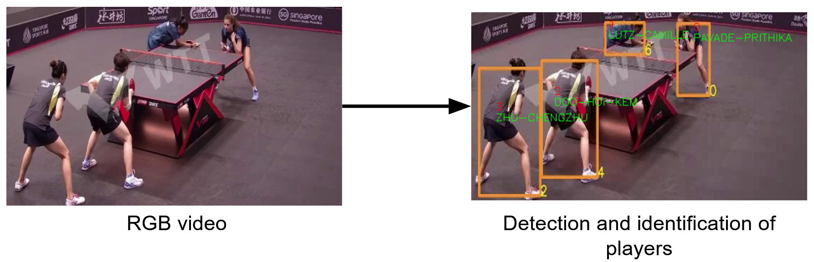
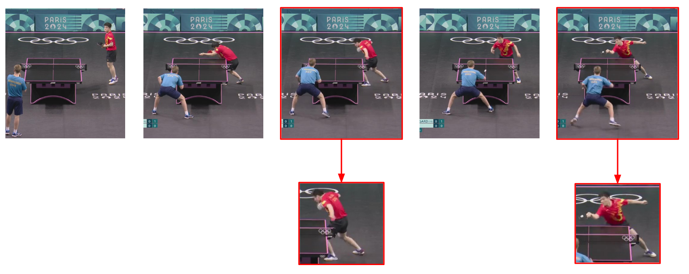
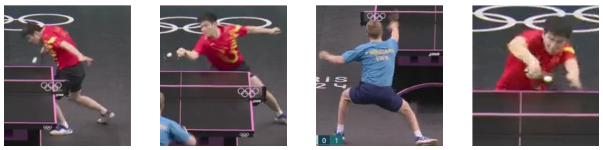
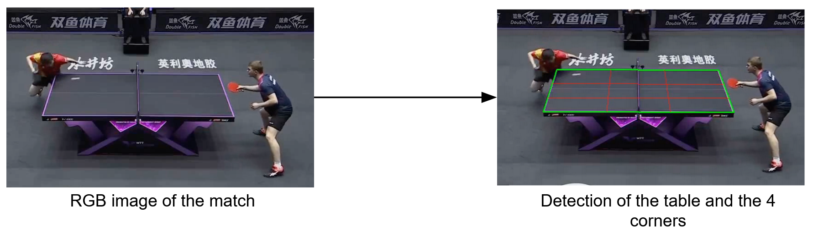
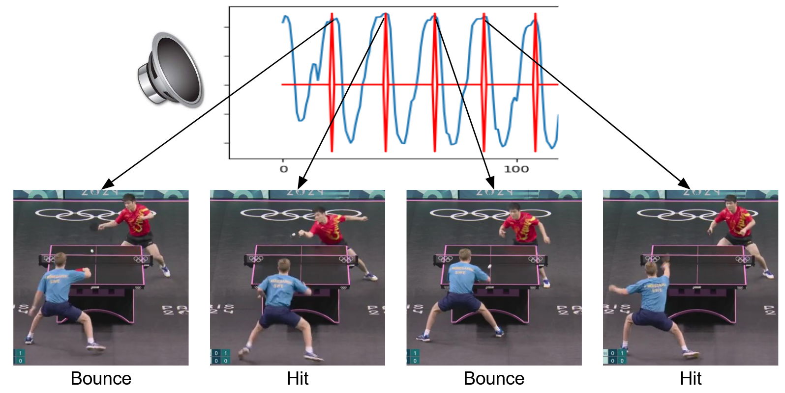

# SportsVideo

This repository presents a Benchmark open to the Research community which consists of a series of six multimedia tasks on table tennis. The first four tasks are related to image and video analysis, the fifth to sound analysis and the last one to textual information extraction. Those tasks have been identified and designed to be as independent. If combined, they can provide a more complete analysis of sports videos for both performance and tactical analysis. 

**Task 1 - Position  Detection** The main information in sports is related to the positions of players in videos featuring different numbers of sides around a table tennis table (seen from various angles). For this task we provide a dataset to dectect bounding boxes of 2 or 4 (depending on whether single or double) of identified players. For this task we provide a total of 50 videos.

**Task 2 - Event Detection** Key information in sports video is related to events, in particular strokes, which are related to a particular time and typology. For this task we provide a dataset to identify the timestamp of the strokes (ie a ball hit with the racket) using close-up video, the classification is achieved with the next task. For this task we provide a total of 1155 videos of strokes.

**Task 3 - Event Classification** The goal of this task is to classify the type of stroke performed by a player in table tennis. For this task we provide a dataset of shortened table tennis stroke videos, each containing either a single stroke or no stroke at all. There are 3 different categories of strokes, services, forehand and backhand. There are 20 potential stroke categories and an extra category for non-strokes. For this task we provide a total of 1155 videos.

**Task 4 - Table Perspective Projection** Sports videos in general, and in particular the ones provided for the SportsVideo task, are usually recorded from the side. This task needs to find the homography transformation for each frame in the dataset. It consists of the projection that maps points of the table tennis space, to corresponding points in the video space. For this task we provide a total of 54 images containing a table.

**Task 5 - Sound Detection** Sports are highly multi-modal events. Sound is an important modality that can be used to detect events. They can be used as additional cues (eg, ball bounces). This task is to detect the exact frame when the ball bounces on the table using sound. In table tennis, the ball bounces on the table for every valide stroke. Videos are provided with the ball annotated. For this task we provide a total of 56 audio files.

**Task 6 - Score and Results Extraction** In most sports, the outcome is presented on a scoreboard, featuring the current score of the game. These scoreboards are typically physical LCD screens close to the referee. Digital versions of scoreboards are also displayed on TV broadcasts as overlays as in table tennis where score and payers' names are displayed. For this task we provide a total of 96 images containing a virtual scoreboard.

